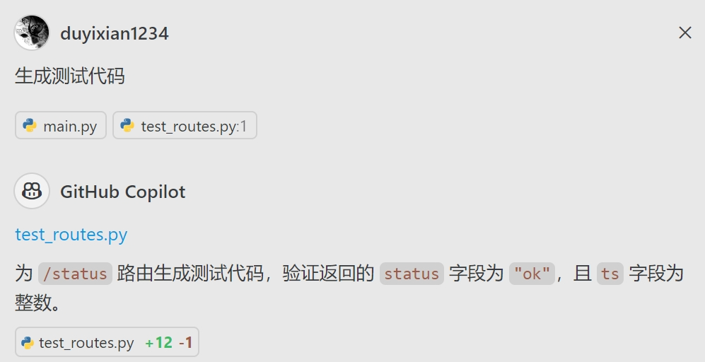
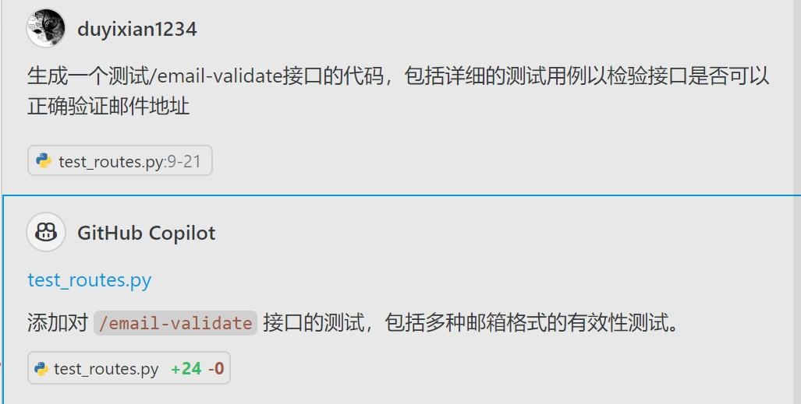
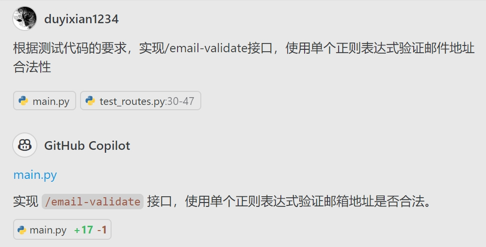
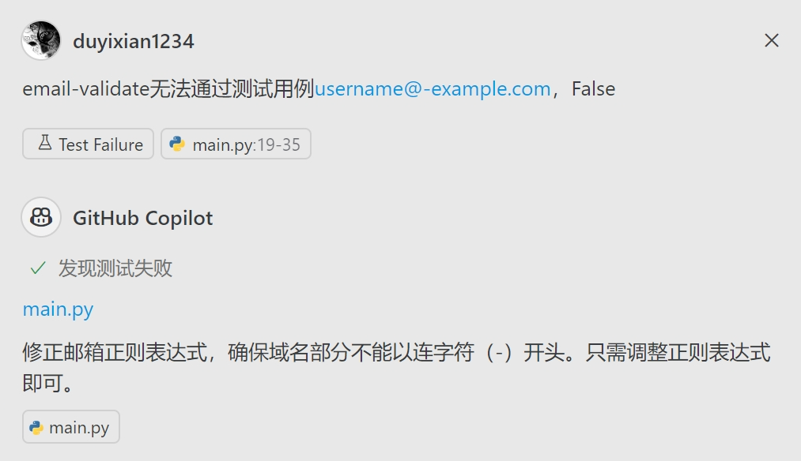

# 测试驱动的 AI 辅助开发

使用 Github Copilot 进行测试驱动的 AI 辅助开发

## 目的

- 通过测试代码提供更明确的任务描述，帮助 AI 理解需求
- 引导AI编写通过测试的代码、提高代码质量

## 流程

1. 编写测试用例（手动编写或 AI 生成）
2. 要求 AI 根据测试用例生成代码
3. 运行测试用例，检查代码是否通过测试
4. 如果测试失败，引导 AI 修复代码（在 Copilot 提示中加入 #testFailure 将测试失败用例添加到上下文中）。

## 交互流程

### 生成现有接口的测试用例

### 生成新需求的测试用例

### 生成代码

### 处理失败的测试用例

